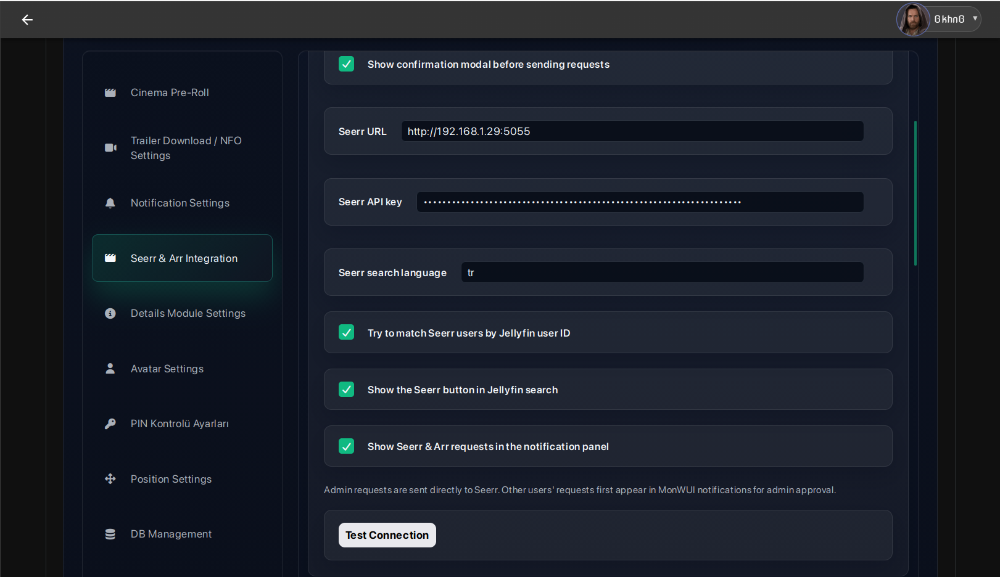
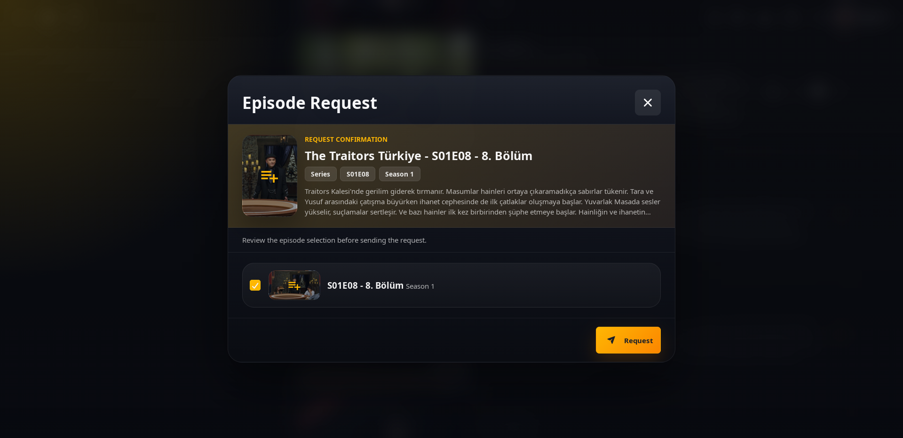
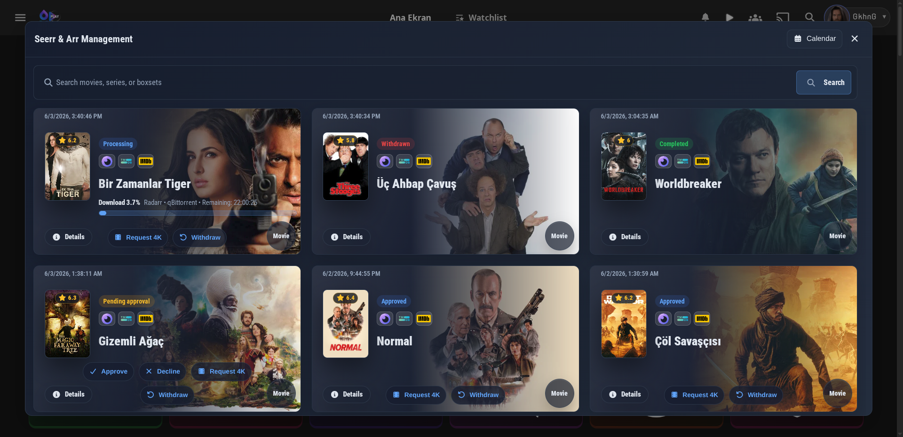
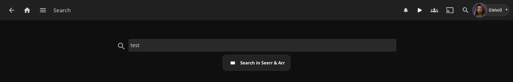
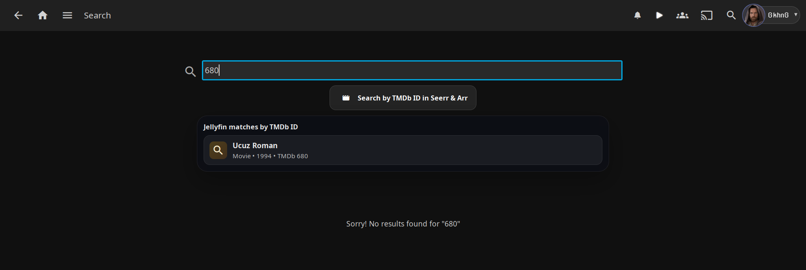
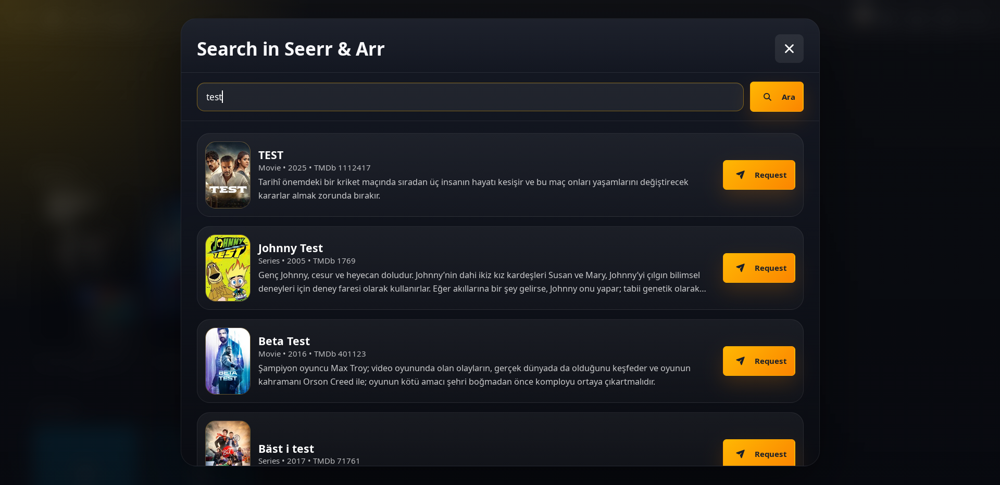
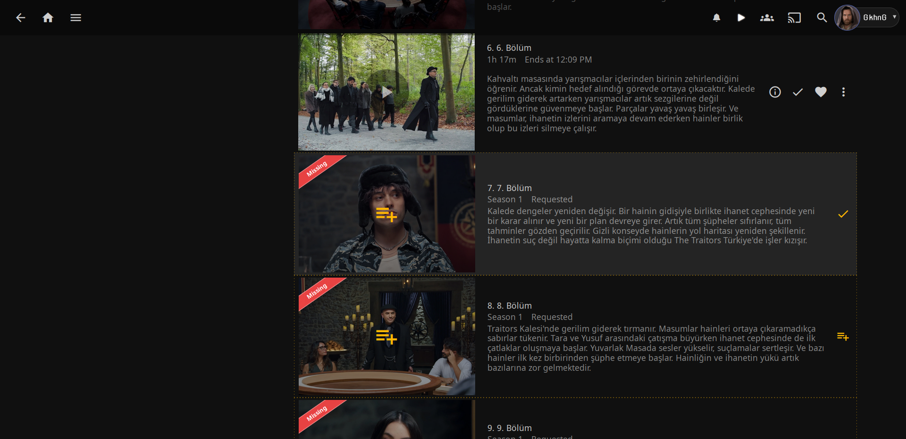
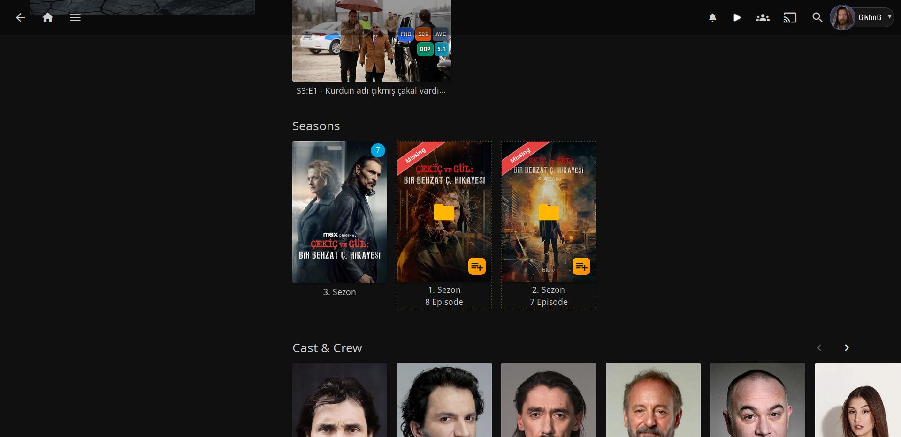
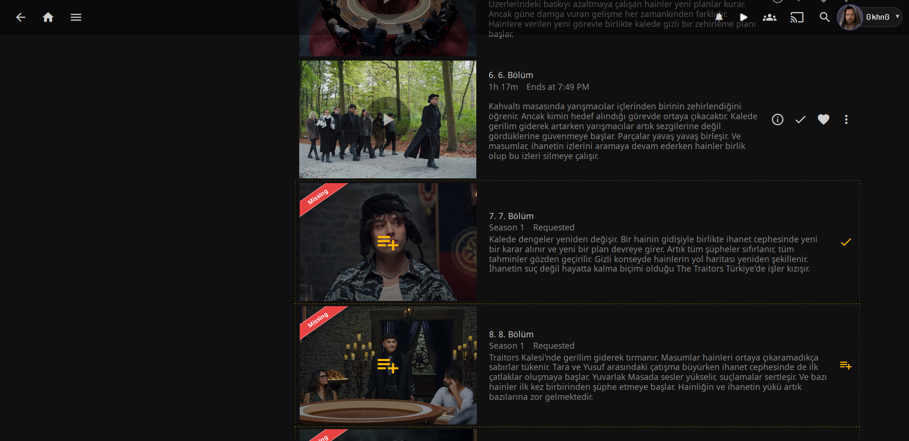

# Seerr & Arr Integration

[Back to README](../README.md)

This document explains the Seerr and Arr integration added to Jellyfin MonWUI Plugin. The feature lets Jellyfin Web users request missing movies, series, seasons, and episodes from the MonWUI interface, with optional admin approval and optional Radarr/Sonarr fallback when Seerr cannot handle the request directly.

## What It Adds

The integration adds a request layer between Jellyfin Web, Seerr, Radarr, and Sonarr.

- Seerr-compatible request support through the plugin server endpoints.
- Radarr fallback for movie requests.
- Sonarr fallback for series, season, and episode requests.
- Admin-only settings for Seerr, Radarr, and Sonarr.
- A Jellyfin search bridge that can search Seerr/Arr when Jellyfin does not show the wanted item.
- Request buttons inside supported Jellyfin item views.
- Missing season and missing episode request controls for series pages.
- Optional confirmation before a request is sent.
- Admin approval workflow for non-admin Jellyfin users.
- Notification panel support with approve, decline, withdraw, and request status display.
- Download progress display for Arr-backed requests when queue data is available.

## Requirements

MonWUI injects this integration into Jellyfin Web. It works on clients that render the Jellyfin Web frontend, such as browser-based Jellyfin Web and mobile clients that embed Jellyfin Web. Native TV clients that do not load `/web/index.html` cannot run this UI.

Required:

- A Jellyfin administrator account for configuration.
- The MonWUI plugin installed and loaded.
- Seerr, Radarr, or Sonarr reachable from the Jellyfin server.
- API keys for the services you enable.
- TMDb provider IDs on Jellyfin items for the best request matching.

Service requirements:

| Service | Required for | Minimum configuration |
| --- | --- | --- |
| Seerr | Main request backend, metadata proxy, Seerr search | Base URL and API key |
| Radarr | Movie fallback, Arr-only movie requests, movie search | Base URL, API key, root folder, quality profile |
| Sonarr | Series, season, and episode fallback or Arr-only requests | Base URL, API key, root folder, quality profile |

The plugin normalizes service API URLs internally. Seerr URLs are sent to `/api/v1`; Radarr and Sonarr URLs are sent to `/api/v3`. You can usually enter the normal service URL, for example `http://localhost:5055`, `http://localhost:7878`, or `http://localhost:8989`.

## Enable The Runtime Module

The frontend runtime has a master switch named **Enable Seerr & Arr integration modules**. Keep this enabled if you want the search bridge, item page buttons, missing episode tools, and notification integration to boot in Jellyfin Web.

If this master switch is disabled, the plugin cleans up the Seerr/Arr frontend bridges even if backend credentials are still saved.

## Configure Seerr

Open **MonWUI Settings** as an administrator and select **Seerr & Arr Integration**.

Set:

- **Enable Seerr integration**: turns on Seerr as the main request backend.
- **Seerr URL**: the base URL of the Seerr-compatible service.
- **Seerr API key**: the API key from Seerr settings.
- **Seerr search language**: language code used for Seerr/TMDb metadata and search, such as `en`, `tr`, or `en-US`.
- **Try to match Seerr users by Jellyfin user ID**: when enabled, MonWUI calls Seerr user lookup and tries to submit the request as the matching Seerr user.
- **Show the Seerr button in Jellyfin search**: shows the search bridge in Jellyfin search pages.
- **Show Seerr & Arr requests in the notification panel**: adds active request tracking to MonWUI notifications.
- **Show confirmation modal before sending requests**: asks the user to confirm the request scope before submission.

Use **Test Connection** after saving the URL and API key. The test calls the Seerr `/settings/about` API through the plugin backend.

  

## Configure Radarr Fallback

Radarr is used for movie fallback and Arr-only movie requests.

Set:

- **Enable Radarr**: enables movie handling through Radarr.
- **Radarr URL**: Radarr base URL.
- **Radarr API key**: API key from Radarr.
- **Radarr root folder path**: target root folder for added movies.
- **Radarr quality profile ID**: quality profile used when adding a movie.
- **Search the movie immediately on fallback**: starts a Radarr `MoviesSearch` command after the movie is added or found.

Use **Test Radarr Connection** to load root folders and quality profiles. Choose the root folder and quality profile from the populated selectors, then save settings.

Radarr request handling:

- Existing Radarr movies are matched by TMDb ID first, then by normalized title.
- Missing movies are looked up through Radarr lookup APIs.
- New movies are added as monitored.
- If immediate search is enabled, MonWUI starts a Radarr movie search command.

## Configure Sonarr Fallback

Sonarr is used for series, season, and single-episode fallback or Arr-only requests.

Set:

- **Enable Sonarr**: enables TV handling through Sonarr.
- **Sonarr URL**: Sonarr base URL.
- **Sonarr API key**: API key from Sonarr.
- **Sonarr root folder path**: target root folder for added series.
- **Sonarr quality profile ID**: quality profile used when adding a series.
- **Sonarr language profile ID**: optional; mostly relevant for Sonarr v3. Use none or `0` for Sonarr v4.
- **Use season folders in Sonarr**: controls the Sonarr `seasonFolder` setting for new series.
- **Search the episode immediately on fallback**: starts Sonarr searches after request submission.

Use **Test Sonarr Connection** to load root folders, quality profiles, and language profiles. Choose the required values and save settings.

Sonarr request handling:

- Existing Sonarr series are matched by TVDb ID, TMDb ID, or normalized title.
- Missing series are looked up through Sonarr lookup APIs.
- Season requests monitor the selected season or all seasons.
- Episode-only requests monitor selected episodes and can start `EpisodeSearch`.
- Season requests can start `SeasonSearch`.
- Full-series requests can start `SeriesSearch`.

## User Request Flow

When a user presses **Request**, MonWUI builds a request payload from the Jellyfin item:

- `mediaType`: `movie` or `tv`
- `mediaId`: TMDb ID
- `tvdbId`: TVDb ID when available for TV content
- `seasons`: selected seasons for TV requests
- `episodes`: selected episode numbers for episode-only requests
- `requestAllSeasons`: true when the full series should be requested
- `title`: item title
- `jellyfinItemId`: original Jellyfin item ID when available

Before submission, the plugin checks local Jellyfin availability. If the movie or episode is already available in Jellyfin, the request is rejected with an already-available message.

If confirmation is enabled, the user sees a confirmation modal showing the title, media type, season scope, and TMDb ID before the request is created.

  

## Admin Approval Flow

Admin users submit directly to the configured backend.

Non-admin users create a pending request inside MonWUI. Administrators can approve or decline it from the MonWUI notification/request management UI.

When an administrator approves a non-admin user's Seerr-backed request, Seerr records the request under the approving administrator account instead of the original Jellyfin requester. MonWUI still keeps the original requester in its own request history and notification UI.

Request states include:

- **Pending approval**: waiting for administrator approval.
- **Approved**: accepted and submitted.
- **Processing**: an active Arr download is detected.
- **Completed**: the item is available or the request reached a completed state.
- **Declined**: rejected by an administrator.
- **Failed**: backend submission failed.
- **Withdrawn**: cancelled by the requester or administrator.

Non-admin users can withdraw their own pending requests. Administrators can withdraw managed requests; if a Seerr request ID exists, MonWUI also attempts to delete the request from Seerr.

  

## Search Bridge

The search bridge appears on Jellyfin search pages when the integration is enabled and **Show the Seerr button in Jellyfin search** is turned on.

It supports:

- Normal title searches.
- TMDb ID searches.
- TMDb URL-style searches.
- Local Jellyfin match hints when a TMDb ID already exists in the library.
- Seerr search when Seerr is configured.
- Arr search fallback when Seerr is not configured but Radarr or Sonarr search is configured.

For normal title queries, the Jellyfin search page exposes a **Search in Seerr & Arr** action.

  

For numeric TMDb ID queries, the bridge can show local Jellyfin matches and switch the action to a TMDb ID search.

  

When the bridge opens the Seerr & Arr modal, results are normalized into movie and series rows. Movie results can be sent to Seerr or Radarr. Series results can be sent to Seerr or Sonarr depending on configuration and request scope.

  

## Item Page Controls

The item page bridge adds request controls to supported Jellyfin details pages.

Supported cases:

- Missing movie request.
- Missing series or season request.
- Missing episode request.
- Selected episode request.
- Full season request.
- Missing seasons and missing episodes on series pages.
- Missing box set item request.

The bridge uses Jellyfin provider IDs and item metadata to resolve TMDb and TVDb IDs. When an ID is missing, the UI can fall back to the Seerr & Arr search modal so the user can search manually.

MonWUI missing episode, season, and box set controls work independently from Jellyfin's native missing episode section. When using the MonWUI Seerr & Arr integration, keep Jellyfin's native **Show missing episodes** option disabled to avoid duplicate missing-item UI.

  

Season cards can show missing season state and direct season request actions.

  

Episode rows can show missing and requested states with per-episode request controls.

  

## Backend Selection Logic

MonWUI chooses the backend in this order:

1. If Seerr is configured, submit to Seerr first.
2. If Seerr succeeds, the request remains a Seerr-backed request.
3. If Seerr fails and Arr can handle the request, submit to Arr fallback.
4. If Seerr is not configured, submit movies to Radarr when Radarr is ready.
5. If Seerr is not configured, submit TV requests to Sonarr when Sonarr is ready.
6. If no backend can handle the request, return a configuration error.

Arr fallback requires more than a URL and API key. For actual requests, Radarr and Sonarr must also have a root folder and quality profile saved.

## Download Progress

When request notifications are loaded with download data enabled, MonWUI checks Arr queues and library records:

- Radarr queue and movie records are used for movie requests.
- Sonarr queue and series records are used for TV requests.
- 4K requests use the configured 4K Radarr/Sonarr queue when that connection is available.
- Active downloads display service name, download client, remaining time, item count, and progress percent when available.

Queue lookups are cached briefly to avoid excessive API calls while the notification panel is open.

## Duplicate And Availability Handling

The integration stores recent requests in the plugin configuration and checks duplicates before creating a new one. Duplicate requests show whether the current user or another user already requested the title.

Local Jellyfin availability is also checked. This prevents requesting content that is already available in the Jellyfin library and lets completed requests disappear from the active request list after the item becomes available.

The stored request list is capped to keep plugin configuration size under control.

## Troubleshooting

| Problem | Check |
| --- | --- |
| The Seerr/Arr UI does not appear | Confirm **Enable Seerr & Arr integration modules** is enabled and hard refresh Jellyfin Web. |
| Search bridge does not appear | Confirm the Jellyfin page is a search page, the query has at least two characters, and **Show the Seerr button in Jellyfin search** is enabled. |
| Seerr test fails | Verify the URL, API key, and that Jellyfin server can reach the Seerr host. |
| Radarr/Sonarr test works but requests fail | Re-test the connection, select a valid root folder and quality profile, then save. |
| Sonarr language profile error | Use a valid language profile for Sonarr v3, or leave it empty/zero for Sonarr v4. |
| Request says already available | Jellyfin already has a non-virtual movie or episode matching the provider ID. |
| Request opens search instead of sending | The Jellyfin item is missing a usable TMDb ID, so manual search is required. |
| Non-admin request does not reach Seerr immediately | This is expected. Non-admin requests wait for admin approval in MonWUI notifications. |

## Local API Routes

These routes are used internally by the frontend modules.

| Route | Purpose |
| --- | --- |
| `/Plugins/MonWUI/seerr/access` | Returns user access, admin status, enabled backend flags, and safe settings. |
| `/Plugins/MonWUI/seerr/settings` | Admin-only Seerr settings read/write. |
| `/Plugins/MonWUI/seerr/test` | Admin-only Seerr connection test. |
| `/Plugins/MonWUI/seerr/search` | Seerr search or Arr fallback search. |
| `/Plugins/MonWUI/seerr/request` | Creates a MonWUI request and submits immediately when allowed. |
| `/Plugins/MonWUI/seerr/requests` | Lists visible active or historical requests. |
| `/Plugins/MonWUI/seerr/online/trending` | Trending movies/series (TMDb primary, Seerr fallback), deduped against the local library. |
| `/Plugins/MonWUI/seerr/online/discover` | Discover by genre/sort (TMDb primary, Seerr fallback), deduped against the local library. |
| `/Plugins/MonWUI/seerr/online/recommendations` | Recommendations/similar seeded from a TMDb id, deduped against the local library. |
| `/Plugins/MonWUI/seerr/online/genres` | Genre id/name list for the requested media type. |
| `/Plugins/MonWUI/seerr/requests/{id}/approve` | Admin-only approval. |
| `/Plugins/MonWUI/seerr/requests/{id}/decline` | Admin-only decline. |
| `/Plugins/MonWUI/seerr/requests/{id}/withdraw` | Request withdrawal. |
| `/Plugins/MonWUI/arr/settings` | Admin-only Arr settings read/write. |
| `/Plugins/MonWUI/arr/sonarr/test` | Admin-only Sonarr connection test and option fetch. |
| `/Plugins/MonWUI/arr/radarr/test` | Admin-only Radarr connection test and option fetch. |
| `/Plugins/MonWUI/arr/episode` | Admin-only direct Sonarr episode request. |
| `/Plugins/MonWUI/arr/movie` | Admin-only direct Radarr movie request. |

## Online Recommendations

The home recommendation rows (Personalized Recommendations, Because You Watched,
and the Genre rows) are no longer local-only. When online recommendations are
enabled, MonWUI blends in items sourced from TMDb (primary) or Overseerr /
Jellyseerr (fallback):

- **Personalized rows** are seeded from the user's recent watch history (TMDb
  recommendations/similar), falling back to trending when history is thin.
- **Genre rows** are enriched with TMDb discover results for that genre.
- **Because You Watched** rows are seeded from that specific title's TMDb id.
- Two new **Trending Movies** and **Trending Series** rows are added, rendered
  with the same cards and CSS as every other row.
- **Popular in X** rows: one merged (movies + series) row per configured
  country, using TMDb region-aware popularity (`/movie/popular?region=` and
  `/discover/tv?watch_region=`). Admins pick the countries in settings (up to 5);
  an **Auto-detect** entry resolves per-viewer from the browser locale (no IP
  geolocation). Own enable toggle.

Items that already exist in the local Jellyfin library are deduped and rendered
as normal local cards (they open the details modal). Items that are missing
locally are rendered as online cards with a **Request** button that submits a
Seerr/Arr request immediately through the existing request pipeline (confirm
modal, admin approval, and Arr fallback all apply). The Request button only
appears when a request backend (Seerr or Radarr/Sonarr) is configured.

Online cards are enriched with the **content rating** (certification) and
**runtime** so their chips match local cards. Owned items reuse the library's
own values; missing items are filled from a per-title TMDb detail call
(bounded concurrency, 24h cache). The certification region defaults to the
Seerr language's region and can be overridden.

### Settings

Everything recommendation-related lives in a single **Recommendations** tab,
available to all users. It has two parts:

- **Home recommendation rows (this browser)** — per-user, saved locally, applied
  instantly. These moved here from the Studio tab: Personalized ("For You"),
  Because You Watched, Genre Hubs, and Director Collections (enable toggles,
  hero-card toggles, row/card counts, genre order). *(Recently-added / Top 10 /
  TMDb rows stay under the Studio tab's "Recent rows" group, which they're gated
  by.)*
- **Online recommendations (server-wide)** — admin only, saved to the plugin
  config:
  - **Show online recommendations** — master toggle.
  - **TMDb API key** — used for discovery and enrichment (free at themoviedb.org).
  - **Show Trending Movies / Trending Series rows.**
  - **Show 'Popular in <country>' rows** + a **country picker** (up to 5, plus
    an Auto-detect option).
  - **Fetch content rating and runtime for online cards** — enrichment toggle.
  - **Content rating region** — e.g. `US`, `TR`, `DE`; blank derives from the
    Seerr language.

Discovery works with a TMDb API key and/or a configured Seerr instance;
requests require Seerr or Arr.

## Notes

- Configuration is stored in the MonWUI plugin configuration.
- API keys are only returned to admin settings calls.
- Users must have a valid Jellyfin session because frontend requests include Jellyfin user and token headers.
- Best matching depends on accurate TMDb and TVDb provider IDs in Jellyfin metadata.
- After changing settings, hard refresh Jellyfin Web if the frontend still shows old behavior.
